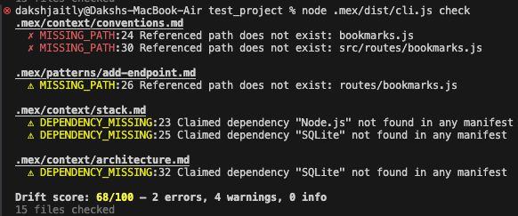
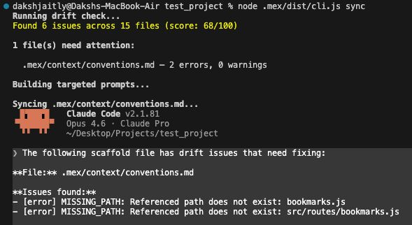
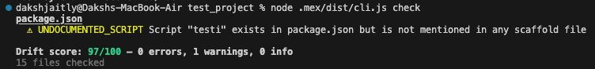

<div align="center">


```
  ███╗   ███╗███████╗██╗  ██╗
  ████╗ ████║██╔════╝╚██╗██╔╝
  ██╔████╔██║█████╗   ╚███╔╝
  ██║╚██╔╝██║██╔══╝   ██╔██╗
  ██║ ╚═╝ ██║███████╗██╔╝ ██╗
  ╚═╝     ╚═╝╚══════╝╚═╝  ╚═╝
```

**mex**

[](https://github.com/theDakshJaitly/mex/actions/workflows/ci.yml)
[](LICENSE)
[](https://www.npmjs.com/package/promexeus)

</div>

---

AI agents forget everything between sessions. mex gives them permanent, navigable project memory.

Every session starts cold:

- The agent has **no idea** what it built yesterday
- It forgets the conventions you agreed on
- It doesn't know what broke last week

Developers compensate by stuffing everything into CLAUDE.md — but that floods the context window, burns tokens, and degrades attention. Meanwhile, the project changes and nobody updates the docs. The agent's understanding drifts from reality.

mex is a structured markdown scaffold with a CLI that keeps it honest. The scaffold gives agents persistent project knowledge through navigable files — architecture, conventions, decisions, patterns. The CLI detects when those files drift from the actual codebase, and targets AI to fix only what's broken. The scaffold grows automatically — after every task, the agent updates project state and creates patterns from real work.

Works with any stack — JavaScript, Python, Go, Rust, and more.

## Star History

[](https://star-history.com/#theDakshJaitly/mex&Timeline)

## Install

The npm package is named `promexeus` (our social handle — `mex` was taken on npm). The CLI command is `mex`.

```bash
npx promexeus setup
```

That's it. The setup command creates the `.mex/` scaffold, asks which AI tool you use, pre-scans your codebase, and generates a targeted prompt to populate everything. Takes about 5 minutes.

At the end of setup, you'll be asked to install mex globally. If you accept:

```bash
mex check        # drift score
mex sync         # fix drift
```

If you skip global install, everything still works via npx:

```bash
npx promexeus check        # drift score
npx promexeus sync         # fix drift
```

You can install globally later at any time:

```bash
npm install -g promexeus
```

### Windows

The recommended `npx promexeus setup` flow runs in any terminal (Command Prompt, PowerShell, or WSL) and does not need bash, so most Windows users do not have to think about this section.

If you previously installed via the legacy `setup.sh` script, do not mix environments. Building inside WSL and then running the CLI from a native Windows terminal causes "module not found" errors because `node_modules` and path resolution differ between the two filesystems. Run install, build, and CLI commands inside the same environment: either entirely in WSL / Git Bash, or entirely in native Windows via `npx promexeus`.

See [issue #10](https://github.com/theDakshJaitly/mex/issues/10) for context.

## Drift Detection

Eight checkers validate your scaffold against the real codebase. Zero tokens, zero AI.

| Checker | What it catches |
|---------|----------------|
| **path** | Referenced file paths that don't exist on disk |
| **edges** | YAML frontmatter edge targets pointing to missing files |
| **index-sync** | `patterns/INDEX.md` out of sync with actual pattern files |
| **staleness** | Scaffold files not updated in 30+ days or 50+ commits |
| **command** | `npm run X` / `make X` referencing scripts that don't exist |
| **dependency** | Claimed dependencies missing from `package.json` |
| **cross-file** | Same dependency with different versions across files |
| **script-coverage** | `package.json` scripts not mentioned in any scaffold file |

Scoring: starts at 100. Deducts -10 per error, -3 per warning, -1 per info.

<!-- TODO: Add screenshot of `mex check` terminal output here -->
 

## CLI

All commands run from your **project root**. If you didn't install globally, replace `mex` with `npx promexeus`.

### Commands

| Command | What it does |
|---------|-------------|
| `mex setup` | First-time setup — create `.mex/` scaffold and populate with AI |
| `mex setup --dry-run` | Preview what setup would do without making changes |
| `mex check` | Run all 8 checkers, output drift score and issues |
| `mex check --quiet` | One-liner: `mex: drift score 92/100 (1 warning)` |
| `mex check --json` | Full report as JSON for programmatic use |
| `mex check --fix` | Check and jump straight to sync if errors found |
| `mex sync` | Detect drift → choose mode → AI fixes → verify → repeat |
| `mex sync --dry-run` | Preview targeted prompts without executing |
| `mex sync --warnings` | Include warning-only files in sync |
| `mex init` | Pre-scan codebase, build structured brief for AI |
| `mex init --json` | Raw scanner brief as JSON |
| `mex watch` | Install post-commit hook (silent on perfect score) |
| `mex watch --uninstall` | Remove the hook |
| `mex commands` | List all commands and scripts with descriptions |




Running check after drift is fixed by sync



## Before / After

Real output from testing mex on Agrow, an AI-powered agricultural voice helpline (Python/Flask, Twilio, multi-provider pipeline).

**Scaffold before setup:**
```markdown
## Current Project State
<!-- What is working. What is not yet built. Known issues.
     Update this section whenever significant work is completed. -->
```

**Scaffold after setup:**
```markdown
## Current Project State

**Working:**
- Voice call pipeline (Twilio → STT → LLM → TTS → response)
- Multi-provider STT (ElevenLabs, Deepgram) with configurable selection
- RAG system with Supabase pgvector for agricultural knowledge retrieval
- Streaming pipeline with barge-in support

**Not yet built:**
- Admin dashboard for call monitoring
- Automated test suite
- Multi-turn conversation memory across calls

**Known issues:**
- Sarvam AI STT bypass active — routing to ElevenLabs as fallback
```

**Patterns directory after setup:**
```
patterns/
├── add-api-client.md       # Steps, gotchas, verify checklist for new service clients
├── add-language-support.md  # How to extend the 8-language voice pipeline
├── debug-pipeline.md        # Where to look when a call fails at each stage
└── add-rag-documents.md     # How to ingest new agricultural knowledge
```

## Real World Results

Independently tested by a community member on **OpenClaw** across 10 structured scenarios on a homelab setup (Ubuntu 24.04, Kubernetes, Docker, Ansible, Terraform, networking, monitoring). 10/10 tests passed. Drift score: 100/100.

**Token usage before vs after mex:**

| Scenario | Without mex | With mex | Saved |
|----------|------------|---------|-------|
| "How does K8s work?" | ~3,300 tokens | ~1,450 tokens | 56% |
| "Open UFW port" | ~3,300 tokens | ~1,050 tokens | 68% |
| "Explain Docker" | ~3,300 tokens | ~1,100 tokens | 67% |
| Multi-context query | ~3,300 tokens | ~1,650 tokens | 50% |

**~60% average token reduction per session.**

Context is no longer all-or-nothing — loaded on demand, only what's relevant.

## How It Works

```
Session starts
    ↓
Agent loads CLAUDE.md (auto-loaded, lives at project root)
    ↓
CLAUDE.md says "Read .mex/ROUTER.md before doing anything"
    ↓
ROUTER.md routing table → loads relevant context file for this task
    ↓
context file → points to pattern file if task-specific guidance exists
    ↓
Agent executes with full project context, minimal token cost
    ↓
After task: agent updates scaffold (GROW step)
    ↓
New patterns, updated project state — scaffold grows from real work
```

CLAUDE.md stays at ~120 tokens. The agent navigates to only what it needs. After every task, the agent updates the scaffold — creating patterns from new task types, updating project state, fixing stale context. The scaffold compounds over time.

## File Structure

```
your-project/
├── CLAUDE.md              ← auto-loaded by tool, points to .mex/
├── .mex/
│   ├── ROUTER.md          ← routing table, session bootstrap
│   ├── AGENTS.md          ← always-loaded anchor (~150 tokens)
│   ├── context/
│   │   ├── architecture.md   # how components connect
│   │   ├── stack.md           # technology choices and reasoning
│   │   ├── conventions.md     # naming, structure, patterns
│   │   ├── decisions.md       # append-only decision log
│   │   └── setup.md           # how to run locally
│   └── patterns/
│       ├── INDEX.md           # pattern registry
│       └── *.md               # task-specific guides with gotchas + verify checklists
└── src/
```

## Multi-Tool Compatibility

| Tool | Config file |
|------|------------|
| Claude Code | `CLAUDE.md` |
| Cursor | `.cursorrules` |
| Windsurf | `.windsurfrules` |
| GitHub Copilot | `.github/copilot-instructions.md` |
| OpenCode | `.opencode/opencode.json` |
| Codex (OpenAI) | `AGENTS.md` |

Most config files embed the same instructions directly. OpenCode is the exception — `.opencode/opencode.json` references `.mex/AGENTS.md` instead of embedding content. `mex setup` asks which tool you use and creates the appropriate config.

Neovim users have their own guide: see [docs/vim-neovim.md](docs/vim-neovim.md) for Claude Code, Avante.nvim, Copilot.vim, and generic-plugin setups.

## Contributing

Contributions welcome! See [CONTRIBUTING.md](CONTRIBUTING.md) for setup and guidelines.

## Changelog

See [CHANGELOG.md](CHANGELOG.md) for release history.

## License

[MIT](LICENSE)
