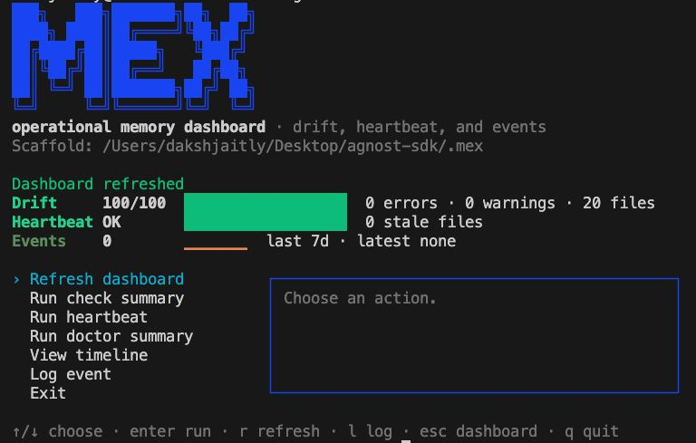
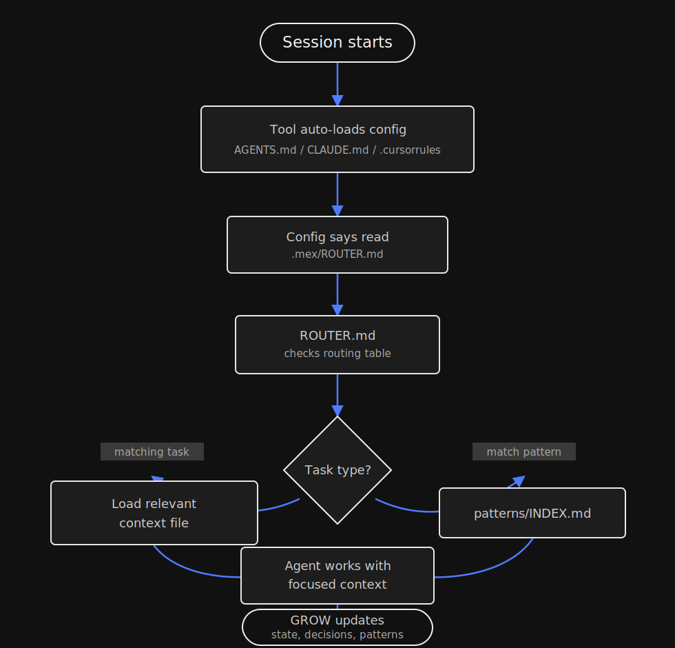
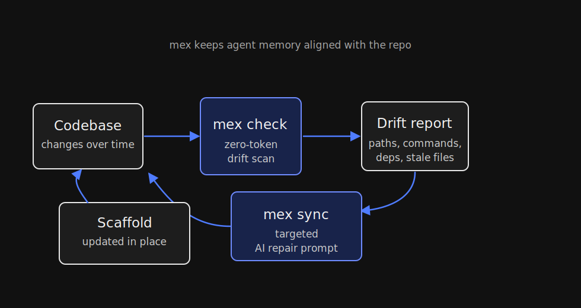

<!-- Translated from README.md at commit: 735e38a -->

<div align="center">


<br>


<h1 align="center">Mex: camada de memória de projetos para agentes de programação com IA</h1>

**Memória persistente de projetos para agentes de programação com IA.**

[English](README.md) | [简体中文](README.zh-CN.md) | [Español](README.es.md) | **Português (Brasil)**

[](https://www.npmjs.com/package/mex-agent)
[](https://www.npmjs.com/package/mex-agent)
[](https://github.com/theDakshJaitly/mex/stargazers)
[](https://mexmemory.com)
[](https://discord.gg/VG7ySSMQM)
[](LICENSE)
[](https://github.com/theDakshJaitly/mex/actions/workflows/ci.yml)
[](package.json)
[](package.json)
[](README.md)
[](#servidor-mcp)

</div>

---

Agentes de programação com IA esquecem tudo entre as sessões. O Mex oferece uma memória de projeto permanente e navegável para que cada sessão comece com o contexto certo, em vez de um bloco de instruções sem direção. Ele ajuda a compreender o código, preservar decisões e manter o contexto do projeto alinhado ao repositório por meio de ferramentas para desenvolvedores.

> **Status da versão:** o npm e a `main` permanecem na versão estável v0.6.3. O grafo de código baseado em AST/Tree-sitter é uma prévia para desenvolvedores da versão v0.7.0 ainda não lançada, disponível em `code-graph-preview`; ele ainda não foi publicado no npm.

💬 **Entre na comunidade do Mex no Discord** — discuta ideias, peça ajuda, compartilhe feedback e contribua com o projeto.

[Entrar no Discord →](https://discord.gg/VG7ySSMQM)

```bash
npx mex-agent setup
```

<p align="center">
  
</p>

## Por que usar o Mex?

A maioria das soluções de memória para agentes acaba virando um único arquivo enorme de instruções. Isso funciona por algum tempo, mas depois ocupa a janela de contexto, consome tokens e se afasta do código real.

| Sem o Mex | Com o Mex |
|-----------|-----------|
| Arquivos enormes de `CLAUDE.md` / regras | Um pequeno arquivo âncora e contexto roteado |
| Os agentes esquecem decisões e convenções | Decisões, padrões e o estado do projeto persistem |
| A documentação se afasta silenciosamente do código | `mex check` detecta afirmações desatualizadas ou quebradas no scaffold |
| Toda sessão começa do zero | Os agentes carregam apenas os arquivos relevantes para a tarefa |
| O trabalho recorrente depende de conhecimento informal | Novos padrões surgem de tarefas reais |

## O que ele faz

O Mex cria um scaffold estruturado em Markdown para a memória do agente:

- `AGENTS.md` / `CLAUDE.md` — pequeno arquivo âncora carregado pela ferramenta
- `ROUTER.md` — tabela que direciona tarefas para contextos específicos
- `context/` — arquitetura, stack, configuração, decisões e convenções
- `patterns/` — guias de tarefas reutilizáveis com observações e etapas de verificação
- `.mex/events/decisions.jsonl` — notas somente para acréscimo por meio de `mex log`

A CLI mantém esse scaffold confiável. Ela verifica caminhos, comandos, dependências, índices de padrões, desatualização e cobertura de scripts sem gastar tokens de IA. Quando encontra divergências, `mex sync` cria instruções direcionadas para que o agente corrija apenas as partes desatualizadas.

## Início rápido

A versão estável no npm é a v0.6.3. Instale-a com Node.js 20 ou mais recente:

O pacote npm se chama `mex-agent` porque `mex` já estava em uso. O comando da CLI continua sendo `mex`.

```bash
npx mex-agent setup
```

Para testar ou contribuir com a prévia do grafo de código, use Node.js 22.5 ou mais recente e compile `code-graph-preview` a partir do código-fonte:

```bash
git clone https://github.com/theDakshJaitly/mex.git
cd mex
git switch code-graph-preview
npm install
npm run build
```

A configuração cria o scaffold `.mex/`, pergunta qual ferramenta de IA você usa, pré-analisa o repositório e gera uma instrução direcionada para preencher os arquivos de memória. O processo leva cerca de cinco minutos.

Ao final da configuração, você pode instalar o Mex globalmente:

```bash
mex check        # pontuação de divergência
mex sync         # corrigir divergências
```

Se você não fizer a instalação global, use npx:

```bash
npx mex-agent check
npx mex-agent sync
```

Também é possível instalar globalmente a qualquer momento:

```bash
npm install -g mex-agent
```

### Windows

O fluxo recomendado, `npx mex-agent setup`, funciona em qualquer terminal (Prompt de Comando, PowerShell ou WSL) e não precisa de bash. Portanto, a maioria dos usuários do Windows não precisa se preocupar com esta seção.

> **Usuários do Windows (fluxo antigo com `setup.sh`):** executem todos os comandos no WSL ou Git Bash. Não misturem ambientes.

Se você instalou anteriormente pelo script antigo `setup.sh`, compilar dentro do WSL e depois executar a CLI em um terminal nativo do Windows provoca erros de “module not found”, pois `node_modules` e a resolução de caminhos diferem entre os dois sistemas de arquivos. Execute instalação, compilação e comandos da CLI no mesmo ambiente: tudo no WSL / Git Bash ou tudo no Windows nativo por meio de `npx mex-agent`.

Consulte a [issue #10](https://github.com/theDakshJaitly/mex/issues/10) para mais contexto.

## Como funciona



O agente começa com um pequeno arquivo carregado automaticamente. Esse arquivo aponta para `ROUTER.md`, e o roteador carrega apenas o contexto necessário para a tarefa atual. Depois de um trabalho relevante, a etapa GROW atualiza o estado do projeto, as decisões e os padrões de tarefas para que o scaffold se torne mais útil ao longo do tempo.

Fonte editável: [docs/diagrams/context-routing.excalidraw](docs/diagrams/context-routing.excalidraw)

## Detecção de divergências

Onze verificadores validam o scaffold em relação ao código real. Zero tokens, zero IA.

| Verificador | O que detecta |
|-------------|---------------|
| **path** | Caminhos referenciados que não existem no disco |
| **edges** | Destinos de arestas no frontmatter YAML que apontam para arquivos ausentes |
| **index-sync** | `patterns/INDEX.md` fora de sincronia com os arquivos de padrões reais |
| **staleness** | Arquivos do scaffold sem atualização há mais de 30 dias ou 50 commits |
| **command** | Referências `npm run X` / `make X` a scripts inexistentes |
| **dependency** | Dependências declaradas ausentes no `package.json` |
| **cross-file** | A mesma dependência com versões diferentes entre arquivos |
| **script-coverage** | Scripts do `package.json` não mencionados em nenhum arquivo do scaffold |
| **tool-config-sync** | Arquivos de configuração de ferramentas de IA instaladas (por exemplo, `CLAUDE.md`, `.cursorrules`) fora de sincronia entre si |
| **todo-fixme** | Marcadores `TODO` / `FIXME` não resolvidos no Markdown do scaffold |
| **broken-link** | Links Markdown locais para arquivos que não existem no disco |

A pontuação começa em 100. O Mex desconta 10 por erro, 3 por aviso e 1 por informação.



Fonte editável: [docs/diagrams/drift-sync.excalidraw](docs/diagrams/drift-sync.excalidraw)

## Comandos

Todos os comandos são executados a partir da raiz do projeto. Se você não fez uma instalação global, substitua `mex` por `npx mex-agent`.

| Comando | O que faz |
|---------|-----------|
| `mex` | Abre o painel interativo no terminal |
| `mex tui` | Abre explicitamente o painel interativo no terminal |
| `mex setup` | Configuração inicial: cria o scaffold `.mex/` e o preenche com IA |
| `mex setup --mode agent-memory` | Cria modelos para espaços de memória de agentes persistentes / homelab |
| `mex setup --dry-run` | Visualiza a configuração sem fazer alterações |
| `mex check` | Executa os verificadores de divergência e mostra um relatório com pontuação |
| `mex check --quiet` | Uma linha: `mex: drift score 92/100 (1 warning)` |
| `mex check --json` | Relatório completo em JSON |
| `mex check --fix` | Verifica e segue direto para a sincronização quando encontra erros |
| `mex sync` | Detecta divergências, escolhe o modo, permite que a IA corrija, verifica e repete |
| `mex sync --dry-run` | Visualiza instruções direcionadas sem executá-las |
| `mex sync --warnings` | Inclui na sincronização arquivos que têm apenas avisos |
| `mex init` | Pré-analisa o repositório e cria um resumo estruturado para a IA |
| `mex init --json` | Resumo bruto do analisador em JSON |
| `mex log <message>` | Acrescenta uma nota, decisão, risco ou tarefa pendente |
| `mex timeline` | Exibe entradas recentes do log de eventos |
| `mex heartbeat` | Executa uma vez verificações leves de integridade para agentes persistentes |
| `mex doctor` | Resumo legível da integridade do scaffold |
| `mex watch` | Instala um hook post-commit |
| `mex watch --interval` | Executa heartbeat repetidamente em primeiro plano |
| `mex watch --uninstall` | Remove o hook |
| `mex completion <shell>` | Exibe o autocompletar para o shell |
| `mex commands` | Lista comandos e scripts com descrições |

## Ferramentas compatíveis

`mex setup` pergunta qual ferramenta você usa e cria o arquivo de configuração adequado.

| Ferramenta | Arquivo de configuração |
|------------|-------------------------|
| Claude Code | `CLAUDE.md` |
| Cursor | `.cursorrules` |
| Windsurf | `.windsurfrules` |
| GitHub Copilot | `.github/copilot-instructions.md` |
| OpenCode | `.opencode/opencode.json` |
| Codex | `AGENTS.md` |

Usuários do Neovim podem consultar [docs/vim-neovim.md](docs/vim-neovim.md) para configurar Claude Code, Avante.nvim, Copilot.vim e plugins genéricos.

## Servidor MCP

`packages/mex-mcp` expõe o Mex a agentes de IA por chamadas nativas do [Model Context Protocol](https://modelcontextprotocol.io): sem executar um shell e com respostas em JSON estruturado. Ele importa `mex-agent` diretamente, portanto as ferramentas executam o mesmo código da CLI e nunca divergem dela.

| Ferramenta | CLI equivalente | Retorno |
|------------|-----------------|---------|
| `mex_check` | `mex check --json` | Relatório de divergência: pontuação, problemas e arquivos verificados |
| `mex_log` | `mex log` / `mex timeline` | Acrescenta um evento (`decision`/`note`/`risk`/`todo`) ou lê os mais recentes |
| `mex_timeline` | `mex timeline` | Eventos filtrados por tipo/data, mais recentes primeiro |
| `mex_heartbeat` | `mex heartbeat` | Verificação de integridade: arquivos desatualizados e limpeza de memória pendente |
| `mex_read_file` | — | Conteúdo de um arquivo do scaffold, restrito a `.mex/` |

Cada ferramenta aceita um `projectRoot` opcional (por padrão, o diretório atual), então um servidor pode atender a qualquer projeto. Execute `mex setup` primeiro: as ferramentas precisam de um scaffold `.mex/`.

Configure seu cliente (`.mcp.json` do Claude Code / Cursor):

```json
{
  "mcpServers": {
    "mex": {
      "command": "node",
      "args": ["packages/mex-mcp/dist/index.js"]
    }
  }
}
```

Compile primeiro com `npm run build --workspace mex-mcp`. Depois da publicação, isso se tornará `"command": "npx", "args": ["mex-mcp"]`.

No início de uma sessão, o agente se orienta com duas chamadas:

```
mex_check()                   # o scaffold está divergindo?
mex_read_file("ROUTER.md")    # carrega o roteador e depois apenas o contexto necessário
```

## Antes e depois

Saída real dos testes do Mex no Agrow, uma linha de assistência agrícola por voz baseada em IA.

**Scaffold antes da configuração:**

```markdown
## Current Project State
<!-- What is working. What is not yet built. Known issues.
     Update this section whenever significant work is completed. -->
```

**Scaffold depois da configuração:**

```markdown
## Current Project State

**Working:**
- Voice call pipeline (Twilio -> STT -> LLM -> TTS -> response)
- Multi-provider STT with configurable selection
- RAG system with Supabase pgvector
- Streaming pipeline with barge-in support

**Not yet built:**
- Admin dashboard for call monitoring
- Automated test suite
- Multi-turn conversation memory across calls

**Known issues:**
- Sarvam AI STT bypass active; ElevenLabs fallback in use
```

**Diretório de padrões depois da configuração:**

```text
patterns/
├── add-api-client.md
├── add-language-support.md
├── debug-pipeline.md
└── add-rag-documents.md
```

## Resultados no mundo real

Testado de forma independente por um membro da comunidade no **OpenClaw** em 10 cenários estruturados de homelab envolvendo Ubuntu 24.04, Kubernetes, Docker, Ansible, Terraform, redes e monitoramento. Os 10 testes foram aprovados. Pontuação de divergência: 100/100.

| Cenário | Sem o Mex | Com o Mex | Economia |
|---------|-----------|-----------|----------|
| “Como o K8s funciona?” | ~3,300 tokens | ~1,450 tokens | 56% |
| “Abrir uma porta UFW” | ~3,300 tokens | ~1,050 tokens | 68% |
| “Explicar o Docker” | ~3,300 tokens | ~1,100 tokens | 67% |
| Consulta com vários contextos | ~3,300 tokens | ~1,650 tokens | 50% |

**Redução média de aproximadamente 60% dos tokens por sessão.**

## Modo de memória do agente

`mex setup --mode agent-memory` cria um scaffold para agentes persistentes cujo “projeto” é um ambiente operacional, e não um repositório de código. Ele adiciona um contrato `HEARTBEAT.md` e modelos que apresentam o Mex como memória estruturada e roteada por tarefas:

- `ROUTER.md` acompanha o estado operacional atual e direciona o agente aos arquivos de memória corretos.
- `context/` armazena arquitetura, stack, convenções, configuração e decisões.
- `patterns/` armazena procedimentos recorrentes.
- `.mex/events/decisions.jsonl` armazena notas e justificativas somente para acréscimo por meio de `mex log`.

`mex heartbeat` é intencionalmente mais leve que `mex check`: ele lê o frontmatter `last_updated` e os metadados de limpeza da memória, exibe `HEARTBEAT_OK` quando tudo está correto e só informa quando o agente precisa revisar arquivos de contexto ou memória desatualizados. Use `mex watch --interval` para executar heartbeat repetidamente em um espaço de trabalho de agente persistente.

## Configuração

As configurações opcionais ficam em `.mex/config.json`. Valores ausentes usam os padrões.

```json
{
  "staleness": {
    "warnDays": 30,
    "errorDays": 90,
    "warnCommits": 50,
    "errorCommits": 200
  },
  "heartbeat": {
    "staleDays": 7,
    "memoryCleanupDays": 7,
    "dailyMemoryRetentionDays": 14
  },
  "watch": {
    "intervalMinutes": 30
  }
}
```

## Telemetria

O Mex coleta dados de uso anônimos e opcionais (nome do comando, versão e sistema operacional; nunca caminhos, argumentos, conteúdo de arquivos, IP ou dados pessoais) para entender como é usado. Inspecione a carga exata com `mex telemetry inspect` e desative a coleta a qualquer momento com `DO_NOT_TRACK=1`, `MEX_TELEMETRY=0` ou `mex config set telemetry off`. Veja todos os detalhes em [TELEMETRY.md](TELEMETRY.md).

## Ecossistema

O Mex é independente de provedor. Guias de integração, exemplos patrocinados e receitas da comunidade devem ser úteis por conta própria, claramente identificados e mantidos na documentação, em vez de alterar silenciosamente a experiência padrão.

## Como contribuir

Contribuições são bem-vindas. Consulte [CONTRIBUTING.md](CONTRIBUTING.md) para ver a configuração e as diretrizes.

## Registro de alterações

Consulte [CHANGELOG.md](CHANGELOG.md) para conhecer o histórico de versões.

## Licença

[MIT](LICENSE)
