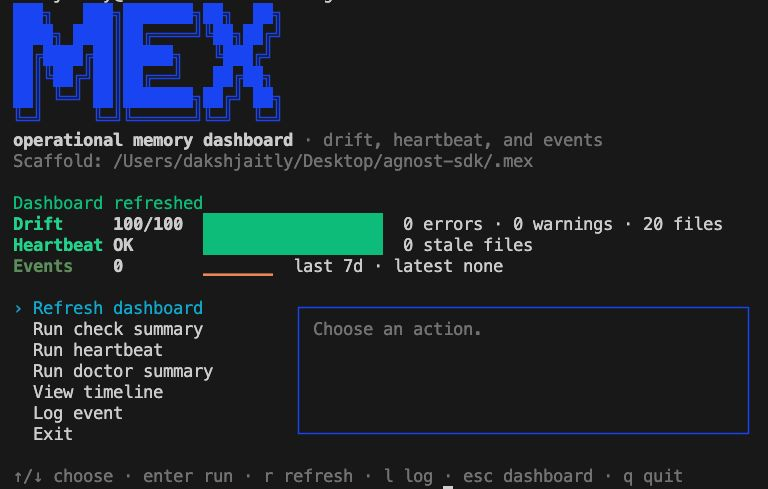
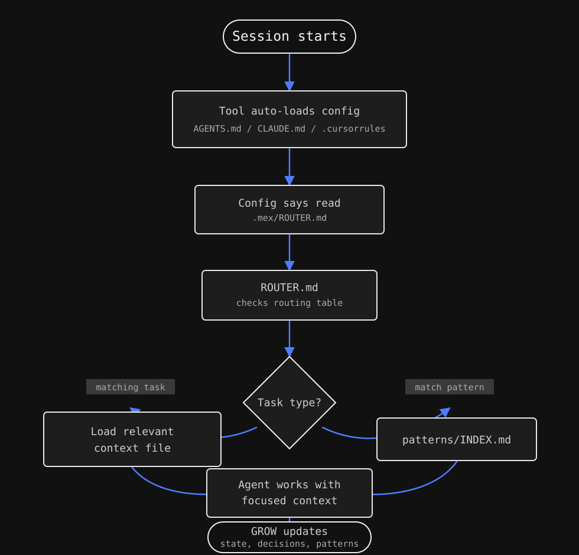
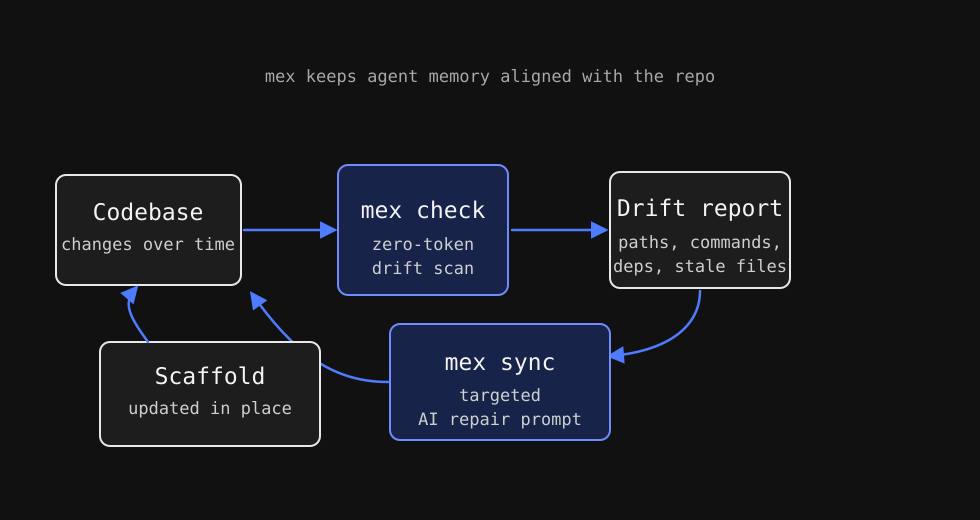

<div align="center">


<br>


**Uma wiki viva para seu código, mantida pelos seus agentes de programação com IA.**

[English](README.md) | [简体中文](README.zh-CN.md) | [Español](README.es.md) | **Português (Brasil)**

[](https://www.npmjs.com/package/mex-agent)
[](https://www.npmjs.com/package/mex-agent)
[](https://github.com/mex-memory/mex/stargazers)
[](https://mexmemory.com)
[](https://discord.gg/VG7ySSMQM)
[](LICENSE)
[](https://github.com/mex-memory/mex/actions/workflows/ci.yml)
[](package.json)
[](package.json)
[](#modo-de-memória-do-agente)
[](#servidor-mcp)

</div>

---

mex mapeia seu código, transforma o que os agentes aprendem em Markdown estruturado e mantém esse conhecimento conectado à implementação que ele descreve.

Cada sessão de programação começa com o contexto arquitetural relevante, e não com mais uma varredura completa do repositório.

> **Novidade na v0.7.2:** recuperação do grafo com código-fonte em uma única chamada, fluxos de TypeScript resolvidos pelo compilador, evidência determinística e limites rígidos de saída.

💬 **Entre na comunidade do mex no Discord** — discuta ideias, peça ajuda, compartilhe feedback e contribua com o projeto.

[Entrar no Discord →](https://discord.gg/VG7ySSMQM)

```bash
npx mex-agent setup
```

<p align="center">
  
</p>

## Seu código sabe mais do que a documentação

Arquitetura, convenções, casos extremos e decisões antigas estão espalhados pelo código-fonte, pull requests, conversas e pelas pessoas que contribuem com o projeto.

Agentes de programação com IA redescobrem esse conhecimento a cada sessão. Um arquivo enorme de instruções pode ajudar no início, mas acaba ocupando a janela de contexto, ficando desatualizado e se afastando da implementação real.

mex cria uma wiki viva dentro do repositório que cresce enquanto os agentes trabalham:

- os agentes documentam o que aprendem em Markdown legível
- um grafo de código determinístico conecta esse conhecimento a símbolos exatos
- o roteamento por tarefa carrega somente o contexto necessário
- verificações de divergência encontram conhecimento afetado por mudanças no código
- o trabalho concluído incorpora decisões, padrões e o estado atual do projeto à wiki

O código continua sendo a fonte da verdade. A wiki se torna sua explicação continuamente mantida.

| Documentação de projeto comum | Wiki viva do mex |
|---|---|
| Escrita uma vez e gradualmente esquecida | Cresce a partir do trabalho real |
| Desconectada da implementação | Afirmações podem apontar para símbolos exatos |
| Carregada como um enorme arquivo de instruções | O contexto é roteado por tarefa |
| Refatorações invalidam documentos silenciosamente | Detecta símbolos alterados, movidos ou removidos |
| Cada agente redescobre a arquitetura | Agentes herdam descobertas e decisões |
| O conhecimento desaparece entre sessões | Decisões e padrões permanecem no repositório |

## Como funciona

### 1. Mapeie o código

mex constrói um grafo de código local e determinístico com Tree-sitter e SQLite. Ele indexa símbolos e relações em TypeScript, TSX, JavaScript, JSX, Python e Rust, incluindo relações de rotas a handlers do Express.

```bash
mex graph
```

### 2. Construa a wiki

Durante a configuração, seu agente usa o grafo para entender o projeto e preencher uma wiki estruturada em Markdown:

```text
.mex/
├── AGENTS.md
├── ROUTER.md
├── context/
│   ├── architecture.md
│   ├── stack.md
│   ├── setup.md
│   ├── decisions.md
│   └── conventions.md
├── patterns/
│   ├── INDEX.md
│   └── ...
└── events/
    └── decisions.jsonl
```

Eles continuam sendo arquivos Markdown comuns: legíveis, revisáveis, versionados e editáveis por pessoas ou agentes.

### 3. Roteie o contexto certo

Os agentes começam com um pequeno arquivo âncora em vez de carregar toda a wiki. Ele aponta para o `ROUTER.md`, que seleciona arquitetura, decisões, convenções e padrões relevantes para a tarefa.

```text
Tarefa do agente
    ↓
Pequena âncora sempre carregada
    ↓
ROUTER.md
    ↓
Páginas relevantes da wiki
    ↓
Vizinhança compacta do grafo
    ↓
Expansão direcionada do código-fonte
```



Fonte editável: [docs/diagrams/context-routing.excalidraw](docs/diagrams/context-routing.excalidraw)

### 4. Mantenha tudo atualizado

Após um trabalho significativo, o agente atualiza o estado do projeto, registra decisões e captura padrões reutilizáveis. mex verifica se a wiki ainda corresponde ao repositório:

```bash
mex check
mex sync
```

`mex check` valida caminhos, comandos, dependências, links, índices, desatualização, configuração de ferramentas e símbolos vinculados sem gastar tokens de IA. Quando algo precisa de reparo, `mex sync` fornece contexto direcionado ao agente em vez de pedir que ele redescubra o projeto inteiro.



Fonte editável: [docs/diagrams/drift-sync.excalidraw](docs/diagrams/drift-sync.excalidraw)

## Vinculada ao código

As páginas da wiki podem conectar afirmações importantes a nós exatos do grafo:

```yaml
---
grounds_to:
  - node: "function:a3f8...c21"
    fingerprint: "mh:64:9f2a..."
---
```

Referências importantes também podem ser navegáveis no texto:

```markdown
A autenticação é aplicada por
[`requireSession()`](mex://function:a3f8...c21).
```

Quando essa função muda, é movida ou desaparece, mex identifica o conhecimento afetado. Renomeações e movimentos confiáveis são vinculados novamente durante a sincronização; casos ambíguos são apresentados ao agente.

Assim, o agente pode ler amplamente para entender um comportamento e vincular somente os poucos símbolos que realmente sustentam o que ele escreve.

## Recuperação compacta para agentes

O grafo também funciona como uma camada compacta de recuperação:

```bash
mex graph scope "rastrear o fluxo de autenticação"
```

Em vez de retornar todo o repositório, o mex prioriza as declarações e os fluxos de execução reais mais prováveis de responder à tarefa, sob um limite rígido de tokens estimados. A resposta padrão inclui código-fonte em registros JSONL determinísticos `meta`, `source`, `flow` e `summary`.

O código-fonte retornado já deve ser considerado lido. Quando o resumo é `ok`, o agente pode responder diretamente mesmo que contexto opcional de menor prioridade tenha sido truncado. A expansão exata continua disponível quando falta uma declaração ou o resumo recomenda uma próxima etapa:

```bash
mex graph get <node-id>
```

Também há consultas estruturais e análise de impacto:

```bash
mex graph query where-defined authenticate
mex graph query who-calls requireSession
mex graph query what-calls createServer
mex impact requireSession
```

Os comandos voltados a agentes usam envelopes JSONL determinísticos para separar metadados, resultados e resumos de forma confiável.

## Resultados

Um piloto de 24 sessões comparou o candidato 0.7.2 com busca apenas em arquivos em 12 tarefas de Hono e MEX:

| Medição | Resultado |
|---|---:|
| Respostas corretas em revisão cega | **7/12 candidato contra 6/12 arquivos** |
| Mudança em novos tokens | **-54,5%** |
| Mudança em tokens processados | **-72,5%** |
| Mudança no custo estimado | **-56,6%** |
| Mudança na latência média | **-22,9%** |
| Trechos de código obrigatórios retornados | **22/23 (95,7%)** |
| Fluxos obrigatórios do Hono retornados | **6/6 (100%)** |

Cada tarefa foi executada uma vez por variante com Claude Sonnet. São resultados descritivos de uma amostra pequena contra uma linha de base que pesquisa apenas arquivos; não comparam com o `main` publicado nem provam economia universal de tokens. Consulte o [relatório do benchmark](evaluate/RESULTS.md) para metodologia e limitações.

Consulte os [resultados do benchmark](evaluate/RESULTS.md) e o [sistema de avaliação](evaluate/README.md) para metodologia, dados, limitações e comandos de reprodução.

## Início rápido

mex requer Node.js 22.5 ou posterior. O pacote npm se chama `mex-agent` porque `mex` já estava ocupado; o comando da CLI continua sendo `mex`.

```bash
npx mex-agent setup
```

A configuração inspeciona o repositório, constrói o grafo local, cria a wiki Markdown, pede ao agente que a preencha com evidências do grafo, instala a âncora correta e valida o resultado.

Depois:

```bash
mex check                    # Verifica a wiki e os vínculos com o código
mex sync                     # Repara divergências com prompts direcionados
mex graph scope "<task>"     # Recupera contexto compacto para uma tarefa
```

Se não estiver instalado globalmente, use `npx mex-agent` no lugar de `mex`. Para instalar globalmente:

```bash
npm install -g mex-agent
```

### Windows

O fluxo recomendado `npx mex-agent setup` funciona no Prompt de Comando, PowerShell ou WSL e não precisa de bash.

Com o fluxo antigo `setup.sh`, execute instalação, build e CLI no mesmo ambiente. Não faça o build no WSL para depois executar a CLI em um terminal nativo do Windows. Consulte a [issue #10](https://github.com/mex-memory/mex/issues/10).

## Comandos principais

| Comando | Função |
|---|---|
| `mex` / `mex tui` | Abre o painel interativo no terminal |
| `mex setup` | Cria e preenche a wiki viva |
| `mex check` | Verifica a wiki e calcula a pontuação de divergência |
| `mex sync` | Repara conhecimento desatualizado ou inconsistente |
| `mex graph` | Constrói ou atualiza o grafo local |
| `mex graph scope <task>` | Recupera contexto compacto para uma tarefa |
| `mex graph get <node-id...>` | Expande símbolos exatos |
| `mex graph query <relation> <symbol>` | Consulta relações estruturais |
| `mex graph ground` | Conecta uma wiki anterior à 0.7 ao grafo |
| `mex impact <symbol\|file>` | Encontra código e wiki afetados por uma mudança |
| `mex log <message>` | Registra decisão, nota, risco ou tarefa |
| `mex timeline` | Mostra eventos recentes |
| `mex heartbeat` | Executa verificações para agentes persistentes |
| `mex completion <shell>` | Imprime completions do shell |
| `mex commands` | Lista todos os comandos e scripts |

## Projetos mex existentes

Projetos anteriores ao mex 0.7 podem adicionar vínculos com o grafo sem regenerar nem reescrever sua documentação:

```bash
mex graph
mex graph ground
```

O agente de migração preserva o texto e adiciona entradas `grounds_to` precisas e referências `mex://` navegáveis. É seguro executá-lo novamente.

Sem um grafo, os verificadores de arquivos e texto continuam funcionando. Se o SQLite ou uma gramática não carregar, as verificações do grafo são ignoradas com um aviso e o restante da CLI continua disponível.

Consulte [Suporte ao grafo](docs/code-graph-support.md) para a matriz de linguagens e relações, degradação gradual e limitações atuais.

## Ferramentas compatíveis

| Ferramenta | Âncora do projeto |
|---|---|
| Claude Code | `CLAUDE.md` |
| Codex | `AGENTS.md` |
| Cursor | `.cursorrules` |
| Windsurf | `.windsurfrules` |
| GitHub Copilot | `.github/copilot-instructions.md` |
| OpenCode | `.opencode/opencode.json` |

Usuários do Neovim podem seguir o [guia de integração](docs/vim-neovim.md).

## Servidor MCP

`packages/mex-mcp` expõe a wiki e o registro de eventos por ferramentas do Model Context Protocol e reutiliza a mesma implementação da CLI.

O pacote MCP ainda não foi publicado. Para desenvolvimento local:

```bash
npm run build --workspace mex-mcp
```

O lançamento principal da v0.7.2 continua sendo a CLI `mex-agent`.

## Modo de memória do agente

A experiência principal do mex é a wiki viva do código. O mesmo modelo também atende agentes persistentes cujo “projeto” é um ambiente operacional:

```bash
mex setup --mode agent-memory
```

Esse modo adiciona um contrato `HEARTBEAT.md` e convenções de limpeza para homelabs, infraestrutura e agentes operacionais de longa duração.

Em um teste comunitário independente com o OpenClaw, mex passou em 10/10 cenários estruturados e reduziu o contexto carregado em cerca de 60% em média. Esses resultados correspondem ao modo de memória e são independentes do benchmark do grafo.

## Princípios

- **Markdown é a interface durável.** Pessoas e agentes podem ler e editar.
- **O código é a fonte da verdade.** Afirmações importantes permanecem conectadas à implementação.
- **O contexto deve ser roteado, não despejado.** Agentes carregam o necessário.
- **O conhecimento deve crescer a partir do trabalho real.**
- **A manutenção deve ser contínua.**
- **A recuperação deve ser determinística.**

## Telemetria

mex coleta dados anônimos e opcionais —nome do comando, versão e sistema operacional—, nunca caminhos, argumentos, conteúdo, endereços IP ou dados pessoais. Inspecione a carga com `mex telemetry inspect` e desative com `DO_NOT_TRACK=1`, `MEX_TELEMETRY=0` ou `mex config set telemetry off`. Veja [TELEMETRY.md](TELEMETRY.md).

## Ecossistema

mex é independente de fornecedor. Integrações, exemplos patrocinados e receitas da comunidade devem ser úteis por si só, claramente identificados e mantidos na documentação.

## Como contribuir

Contribuições são bem-vindas. Consulte [CONTRIBUTING.md](CONTRIBUTING.md).

## Registro de alterações

Consulte [CHANGELOG.md](CHANGELOG.md).

## Licença

[MIT](LICENSE)
