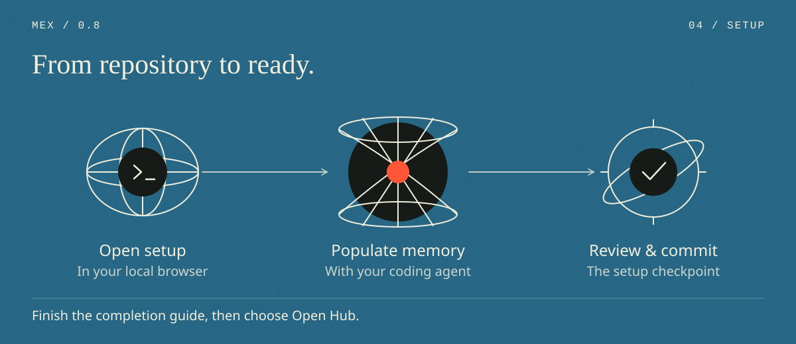

<div align="center">

<h1 id="mex">
  
</h1>

**Memória compartilhada de projeto para engenheiros e seus agentes de programação.**

O MEX mantém a arquitetura, as decisões, os requisitos e as passagens de contexto da sua equipe junto do código. Engenheiros e seus agentes podem trabalhar a partir de um contexto compartilhado, revisar mudanças propostas e dar continuidade ao trabalho entre sessões e colegas — usando o Git como camada de compartilhamento.

[English](README.md) | [简体中文](README.zh-CN.md) | [Español](README.es.md) | **Português (Brasil)**

[](https://www.npmjs.com/package/mex-agent)
[](https://www.npmjs.com/package/mex-agent)
[](https://github.com/mex-memory/mex/stargazers)
[](https://mexmemory.com)
[](https://discord.gg/FEdNsQ4Qt4)
[](https://github.com/mex-memory/mex/blob/v0.8.0/LICENSE)
[](https://github.com/mex-memory/mex/actions/workflows/ci.yml)
[](https://github.com/mex-memory/mex/blob/v0.8.0/package.json)
[](https://github.com/mex-memory/mex/blob/v0.8.0/package.json)
[](#agent-memory-mode)
[](#mcp-server)

[Memória da equipe](#what-your-team-remembers) · [Exemplo de passagem de contexto](#from-one-engineer-to-the-next) · [Project Hub](#project-hub) · [Início rápido](#quick-start) · [Como funciona](#how-mex-works) · [Guia de comandos](#command-map)

</div>

> A descrição principal desta tradução ainda corresponde à versão 0.8.0. Os comandos de instalação e as orientações de atualização foram ajustados para 0.8.2; as mudanças do produto estão documentadas no [README em inglês](README.md) e nas [notas de lançamento da versão 0.8.2](RELEASE_NOTES.md).

---

Uma pessoa sabe por que uma restrição existe. Outra conhece o histórico de depuração. Um agente de programação encontrou um caso extremo importante em uma sessão que ninguém mais vai ler. O próximo colega precisa reconstruir tudo isso.

**O que um engenheiro e seu agente aprendem deve se tornar contexto que o próximo colega possa usar.** O MEX dá a esse conhecimento um lugar duradouro no repositório: Markdown legível, explicações vinculadas ao código, propostas de Spec revisadas e passagens de contexto estruturadas. As pessoas exploram e revisam esse conhecimento em um Hub local; os agentes o consultam e ajudam a mantê-lo por meio das instruções do projeto e da CLI.

> [!IMPORTANT]
> **O [MEX 0.8](https://github.com/mex-memory/mex/releases/tag/v0.8.0) amplia a memória de agentes para a memória da equipe:** um Project Hub local, Wiki estruturada e fluxos de trabalho de equipe, Specs com aprovação explícita, Members, Workstreams, Relays, Activity e skills oficiais para Claude Code/Codex — tudo conectado ao Code Graph e ao sistema de grounding e detecção de divergências já existentes.

💬 **Entre na comunidade do MEX no Discord** — discuta ideias, peça ajuda, compartilhe feedback e mostre o que está construindo.

[Entrar no Discord →](https://discord.gg/FEdNsQ4Qt4)

<a id="what-your-team-remembers"></a>

## O que sua equipe lembra

| O que a equipe precisa preservar | Onde fica no MEX |
| --- | --- |
| Como o sistema funciona e por quê | Arquitetura, decisões, convenções e padrões da Wiki, com grounding no Code Graph |
| O que o produto deve fazer | Specs, requisitos, restrições e critérios de aceitação; propostas no Inbox para mudanças sujeitas a aprovação |
| De onde outro engenheiro deve continuar | Relays com progresso, decisões, impedimentos, evidências e próximas ações |
| O contexto de uma área de trabalho | Workstreams e seu estado registrado |
| Quem está envolvido e o que o MEX registrou | Members e histórico de Activity |


A memória canônica é compartilhada com os comandos habituais de commit, push e pull do Git. Cada colega mantém seus próprios índices locais, rascunhos, seleção de identidade e Hub. Não é necessário um serviço MEX hospedado, Docker, proxy, conta MEX ou chave de modelo gerenciada pelo MEX.

Trabalha sozinho? A próxima pessoa a usar essa memória pode ser você em uma nova sessão.

<a id="from-one-engineer-to-the-next"></a>

## De um engenheiro para o próximo

Um exemplo: Alex altera o tratamento de novas tentativas de webhooks, e Sam vai continuar o trabalho. Ambos são Members ativos do MEX em um repositório já configurado pela equipe.

1. **Comece pelo contexto da equipe.** Alex pede ao Codex que examine a arquitetura existente, as decisões relevantes e as evidências do código antes de fazer a mudança e executar os testes.
2. **Preserve as descobertas úteis.** Sob a orientação de Alex, o Codex atualiza a explicação relevante na Wiki e as referências ao código. Se o trabalho alterar um requisito duradouro do produto, ele prepara uma proposta separada no Inbox para aprovação explícita.
3. **Prepare e publique a passagem de contexto.** Alex pede ao `$mex-relay` que crie um rascunho de Relay para Sam: o que mudou, quais testes foram executados, o que falta e onde procurar a seguir. Ela revisa o rascunho e a prévia de publicação no Hub, publica explicitamente e depois revisa, faz commit e push do código e dos arquivos canônicos do MEX pelo Git.
4. **Continue a partir do contexto compartilhado.** Sam faz pull da branch relevante, atualiza seus índices locais conforme necessário e abre o Hub. Ele revisa e assume o Relay, depois pede ao seu agente de programação que leia esse contexto e continue. Sua confirmação gera outra mudança canônica que precisa de commit e push.


O Relay leva a explicação e o estado observado do repositório — não o código sem commit. A publicação grava arquivos no checkout de Alex; ela não notifica Sam nem entrega nada até que compartilhem pelo Git. Veja os [limites do Relay](#relay-pass-the-context-baton) para detalhes sobre seu ciclo de vida e ações concorrentes.

<a id="project-hub"></a>

## Project Hub

O Hub é onde as pessoas exploram e revisam a memória da equipe. Abra-o para entender uma parte do código, examinar uma proposta de mudança em uma Spec, encontrar uma passagem de contexto direcionada a você ou consultar o histórico registrado da equipe.


- **Entenda o projeto:** Overview, Search, Knowledge, Specs e Code reúnem explicações e evidências da implementação.
- **Revise e dê continuidade ao trabalho:** o Inbox oferece propostas de Spec sujeitas a aprovação; os Relays preservam o que a próxima pessoa precisa; os Workstreams mantêm o contexto ao redor do trabalho.
- **Veja quem participou e o que aconteceu:** Team/Members oferece atribuição e seleção de identidade local. Activity mostra eventos aceitos dos fluxos de trabalho do MEX e notas registradas do projeto — não toda edição de código ou ação do Git.
- **Mantenha o contexto utilizável:** Health e Jobs mostram o estado dos índices e a manutenção explícita.

Após a configuração, execute `mex hub`. O Hub de cada engenheiro lê seu próprio checkout e escuta em `127.0.0.1`; ele não é um painel compartilhado hospedado. O Git traz os registros canônicos da equipe para esse checkout. O Hub protege as alterações com uma sessão no servidor e um token CSRF. Playbooks e Catch Up estão marcados como **Coming Soon** e não estão disponíveis na versão 0.8.

<a id="quick-start"></a>

## Início rápido

O MEX requer **Node.js 22.5 ou mais recente** e um repositório Git. O fluxo normal com npm funciona em macOS, Linux, Prompt de Comando do Windows, PowerShell e WSL.

<a id="introduce-mex-to-your-repository"></a>

### Adicione o MEX ao seu repositório

Execute na raiz do repositório:

```bash
npx mex-agent@0.8.2 setup
```

O comando abre a configuração no navegador local. Escolha as ferramentas de IA, crie o scaffold e os índices e use uma CLI disponível do Claude Code ou Codex para preencher a memória. Se o agente estiver indisponível ou falhar, copie o prompt e continue após o preenchimento manual. As instruções existentes são preservadas; orientações de integração manual não bloqueiam a configuração.

Revise o diff exato no Hub e escolha **Commit setup** para criar um commit local; o ponto de verificação manual do Git continua disponível. A tela final explica como iniciar uma nova sessão e verificar a memória. Ela oferece instalar globalmente a versão em execução e, opcionalmente, deixar um e-mail e um nome opcional. O formulário integrado envia esses dados ao Web3Forms; eles não entram no repositório nem na telemetria. O computador guarda apenas se você enviou ou pulou o convite. Escolha **Open Hub** para abrir o Hub completo e o tour inicial.

Para usar o terminal ou SSH: `npx mex-agent@0.8.2 setup --cli`. `setup --dry-run` continua sendo uma prévia de terminal sem alterações; `--no-open` imprime o link e `--port <n>` escolhe a porta local. Após instalar, `mex` abre o Hub ou a configuração e `mex tui` abre o painel de terminal. Os agentes têm seus próprios requisitos de instalação, conta e rede.



> [!NOTE]
> O Hub completo exige que o `.mex/config.json` atual esteja incluído em `HEAD`. Ele só cria um commit local de configuração após sua revisão e escolha explícita, preservando alterações não relacionadas em staging. O MEX nunca faz push nem pull.

Faça push do commit de configuração revisado pelo fluxo Git normal da equipe para que os colegas recebam a mesma memória de projeto e as instruções dos agentes selecionados. Na página Team/Members do Hub, adicione as pessoas que vão participar e escolha sua identidade local. Revise e aplique essas ações explicitamente; faça commit e push dos novos registros de Member também. A seleção do membro atual permanece local.

<a id="join-a-repository-already-using-mex-08"></a>

### Entre em um repositório que já usa o MEX 0.8

Clone o repositório da equipe ou faça pull da branch pelo Git. Se a configuração da versão 0.8 estiver concluída e incluída em um commit, construa os índices derivados no seu próprio checkout e abra o Hub:

```bash
npx mex-agent@0.8.2 graph rebuild
npx mex-agent@0.8.2 wiki rebuild-index
npx mex-agent@0.8.2 hub
```

Reutilize a memória compartilhada do projeto; não a gere novamente só para entrar na equipe. Em Team/Members, confira a identidade efetiva e, se necessário, selecione seu registro de Member existente para defini-lo localmente. Se você ainda não tiver um registro, crie um explicitamente pelo fluxo com revisão e compartilhe seus arquivos canônicos. Members servem para atribuição, não para login ou controle de permissões.

Os arquivos de instruções e diretórios de skills incluídos nos commits podem ser reutilizados pelos agentes aos quais se destinam. Instale o agente separadamente e inicie uma nova sessão no repositório. Se a integração escolhida não foi incluída na configuração compartilhada, combine sua adição com a equipe; veja as [integrações de agentes](#agent-workflows). Após novos pulls ou mudanças de branch, verifique a saúde do Graph/Wiki e execute a manutenção explícita indicada — as consultas não atualizam os índices silenciosamente.

Configurações antigas ou incompletas devem seguir primeiro a seção de [atualização e compatibilidade](#upgrade-and-compatibility). Mantenha as versões da CLI alinhadas antes de trocar novos Relays.

<details>
<summary><strong>Prefere uma instalação global?</strong></summary>

```bash
npm install -g mex-agent@0.8.2
mex setup
```

O pacote npm se chama `mex-agent`; o comando instalado é `mex`. Conclua a revisão e o commit do ponto de verificação acima antes de executar `mex hub`.

A instalação global opcional, no Hub e no terminal, fixa a versão de MEX em execução. Se falhar, a configuração continua concluída; você pode tentar novamente ou usar o comando acima.

</details>

<a id="agent-memory-mode"></a>
<details>
<summary><strong>Vai usar o MEX com um agente operacional persistente?</strong></summary>

```bash
npx mex-agent@0.8.2 setup --mode agent-memory
```

Esse template separado aplica o modelo de roteamento e manutenção do MEX a ambientes de homelab, infraestrutura e agentes de longa duração. Ele adiciona um contrato `HEARTBEAT.md` e convenções de limpeza; o fluxo de Code Graph, Wiki e Hub de equipe descrito neste README corresponde ao modo padrão `code-repo`.

</details>

Os exemplos usam `mex` para facilitar a leitura. Instale-o globalmente como indicado acima ou substitua-o por `npx mex-agent@0.8.2`.

<a id="how-mex-works"></a>

## Como o MEX funciona

A memória da equipe é compartilhada; os mecanismos para consultá-la permanecem locais. O MEX separa **arquivos canônicos do repositório** de **índices que podem ser reconstruídos**, para que cada engenheiro e agente trabalhe em seu próprio checkout.


<a id="canonical-markdown-local-indexes"></a>

### Markdown canônico, índices locais

O conhecimento canônico é Markdown estruturado com metadados, relações, fontes, proveniência e vínculos com o código (groundings); as gravações aceitas na Wiki acrescentam registros de auditoria. O Code Graph e o índice de busca da Wiki são visões locais em SQLite que podem ser reconstruídas, não fontes da verdade compartilhadas.

| Faça commit e push para compartilhar | Mantenha local ou efêmero; nunca inclua em commits |
| --- | --- |
| `.mex/config.json`, `.mex/.gitignore` | `.mex/graph.db*` |
| `.mex/AGENTS.md`, `.mex/ROUTER.md`, `.mex/SETUP.md`, `.mex/SYNC.md` | `.mex/wiki.db*` |
| `.mex/context/**`, `.mex/patterns/**`, `.mex/specs/**`, `.mex/topics/**` | `.mex/local/**`: rascunhos, seleção do membro atual, jobs, cursores, estado de recuperação, chave de assinatura |
| `.mex/team/members/**`, `.mex/workstreams/**`, `.mex/inbox/**`, `.mex/relays/**` | Registro de sessões do Hub na memória do processo e estado de sessão/CSRF mantido no navegador |
| `.mex/events/activity/**`, `.mex/events/operations.jsonl`, `.mex/events/decisions.jsonl` | — |
| Arquivos de instruções de agentes selecionados na configuração e `.agents/skills/mex-*` ou `.claude/skills/mex-*` | — |

O Git leva o significado; a configuração ou comandos explícitos de manutenção reconstroem os índices com base na branch e na árvore de trabalho de cada checkout. O código continua sendo a referência, e a detecção de divergências no grounding sinaliza explicações vinculadas ao código que precisam de revisão.

<a id="wiki-code-graph-and-grounding"></a>

## Wiki, Code Graph e grounding

A memória compartilhada precisa tanto das explicações da equipe quanto das evidências da implementação. O MEX combina duas visões complementares de um repositório:

- A **Wiki** explica arquitetura, convenções, decisões, padrões, tópicos e Specs em uma linguagem que as pessoas podem revisar.
- O **Code Graph** usa gramáticas Tree-sitter incluídas no pacote para mapear símbolos e relações da implementação em um índice SQLite local, permitindo consultas precisas e com escopo limitado.

Examine-os ou execute a manutenção explicitamente:

```bash
mex graph status
mex graph refresh       # Republish an existing compatible store
mex graph rebuild       # Full replacement when status requires it
mex wiki rebuild-index
mex wiki query "authentication"
```

Peça ao Graph um conjunto de evidências limitado à tarefa ou uma relação estrutural exata:

```bash
mex graph scope "trace the authentication flow"
mex graph query where-defined authenticate
mex graph query who-calls requireSession
mex graph get <node-id>
mex impact requireSession
```

O MEX indexa TypeScript/TSX, JavaScript/JSX, Python e Rust. Variantes de módulos como `.mts`, `.cts`, `.mjs` e `.cjs` têm cobertura parcial, e Express é o único resolvedor específico de framework documentado para a versão 0.8. As consultas exatas `query`, `get` e `impact` — assim como Code no Hub — exigem um Graph comprovadamente atualizado; `scope` pode, em vez disso, retornar evidências limitadas diretamente do texto atual de arquivos desatualizados ou não indexados, claramente marcadas como `text-only`.

<a id="grounding-and-drift"></a>

### Grounding e detecção de divergências

Uma afirmação na Wiki pode apontar para um nó determinístico do grafo. O MEX armazena o ID do nó e sua impressão digital de identidade; novos groundings gravados pelo MEX também incluem um hash do corpo, enquanto groundings antigos compatíveis podem recorrer a uma comparação menos detalhada de impressões digitais. Juntos, esses sinais distinguem referências intactas, alteradas, movidas, ausentes, ambíguas e não verificadas.


Uma divergência é um sinal para revisão. Ela **não** prova que o texto seja falso, que uma mudança no código esteja errada ou que um modelo realmente tenha raciocinado a partir do contexto recuperado.

<a id="agent-workflows"></a>
<a id="agents-help-maintain-the-teams-memory"></a>

## Os agentes ajudam a manter a memória da equipe

Os agentes consultam e também contribuem: podem recuperar o contexto existente da equipe, ajudar a registrar descobertas do trabalho real e preparar propostas de Spec ou passagens de contexto para uma pessoa revisar. Eles não decidem de forma independente o que deve ser publicado ou compartilhado.

A configuração instala pequenas instruções para o agente hospedeiro que apontam para `.mex/AGENTS.md`, com as regras, e `.mex/ROUTER.md`, com o contexto relevante para cada tarefa. Os agentes podem consultar evidências da Wiki e do Graph, desde que o agente hospedeiro siga essas instruções.


| Integração | Comportamento da configuração | Comandos explícitos das skills |
| --- | --- | --- |
| **Claude Code** | Instala ou atualiza as instruções de entrada do projeto e as skills em `.claude/skills/` | `/mex-inbox`, `/mex-relay` |
| **Codex** | Instala ou atualiza as instruções de entrada do projeto e as skills em `.agents/skills/` | `$mex-inbox`, `$mex-relay` |
| **Cursor, Windsurf, GitHub Copilot, OpenCode** | Instala o arquivo de instruções ou template apropriado | Sem comando de skill oficial do MEX na versão 0.8 |

Se uma configuração existente não tiver seus arquivos do Claude Code ou do Codex, visualize e sincronize essa integração explicitamente:

```bash
mex skills sync --dry-run --tool codex
mex skills sync --tool codex
```

Use `--tool claude` para o Claude Code. Revise os arquivos de instruções e skills gerados, faça commit e push se a equipe for compartilhar a integração e inicie uma nova sessão do agente.

As instruções podem selecionar Inbox ou Relay a partir de uma intenção clara em linguagem natural, mas a ativação de uma skill nunca aprova uma gravação canônica. Quando o contexto do MEX influencia materialmente o trabalho, o agente informa quais registros usou; isso oferece transparência, não prova de raciocínio.

O fluxo governado do Inbox se aplica a propostas da família Spec. Atualizações comuns da Wiki e do contexto não passam todas pelo Inbox; revise essas mudanças na árvore de trabalho pelo fluxo normal de engenharia.

<a id="mcp-server"></a>
<details>
<summary><strong>Servidor MCP — somente código-fonte</strong></summary>

O repositório inclui um [workspace MCP](https://github.com/mex-memory/mex/tree/v0.8.0/packages/mex-mcp) para desenvolvimento local. Ele não é publicado com o MEX 0.8; a interface lançada para agentes é a CLI `mex-agent` com suas instruções de projeto e skills.

</details>

<a id="human-approval-boundaries"></a>

### Limites da aprovação humana

| O agente pode preparar | Uma pessoa controla deliberadamente |
| --- | --- |
| Buscar e recuperar evidências da Wiki ou do Graph | Se as evidências recuperadas são suficientes |
| Criar um rascunho do Inbox local ao checkout | A publicação da proposta para revisão no repositório |
| Visualizar uma operação limitada de criação ou atualização de Spec | A aprovação ou rejeição da mudança canônica proposta |
| Criar um rascunho de Relay local ao checkout | A publicação, a aceitação e o encerramento de uma passagem de contexto |
| Sugerir atualizações de contexto e grounding | A revisão e o commit das mudanças na árvore de trabalho |

Os fluxos de equipe usam prévias assinadas para vincular os dados revisados e detectar planos desatualizados ou alterados; a edição da Wiki usa uma separação entre plano e `--apply`. Esses mecanismos protegem a integridade das alterações — não oferecem autenticação, isolamento do sistema operacional, permissões de repositório nem prova de que uma pessoa emitiu o comando.

<a id="team-workflows"></a>

## Fluxos de trabalho de equipe

Esses fluxos ajudam a equipe a decidir o que se torna conhecimento duradouro e a preservar contexto suficiente para outra pessoa continuar. Eles complementam suas ferramentas existentes de revisão de código e acompanhamento de issues.

| Recurso | O que é | Limite de compartilhamento |
| --- | --- | --- |
| **Members** | Registros estáveis de colaboradores e um “membro atual” local ao checkout para atribuição | Os registros de Member usam o Git; a seleção atual permanece local |
| **Workstreams** | Contexto duradouro de uma área de trabalho e seu estado | Markdown canônico pelo Git |
| **Specs** | Requisitos estruturados de produto, restrições e critérios de aceitação | Markdown canônico pelo Git |
| **Inbox** | Propostas sujeitas a aprovação para uma criação ou atualização limitada da família Spec | Rascunho local; proposta publicada e decisões pelo Git |
| **Relays** | Passagens de contexto preparadas por agentes e publicadas por pessoas | Rascunho local; registro publicado, assumido ou encerrado pelo Git |
| **Activity** | Histórico aceito dos fluxos do MEX e registros personalizados | Registros canônicos pelo Git |

Members fornecem atribuição e proveniência. Eles **não** são contas, autenticação, controle de acesso baseado em papéis nem permissões de repositório.

<a id="inbox-propose-before-changing-durable-specs"></a>

### Inbox: proponha antes de alterar Specs duradouras

A skill do Inbox prepara exatamente uma proposta limitada de `spec.create` ou `spec.update` para uma Spec, um requisito, uma restrição ou um critério de aceitação. Um rascunho local pode ser visualizado antes de se tornar um registro do repositório, e a aprovação aplica a operação revisada ao conhecimento canônico.


Cada transição canônica de uma proposta ainda precisa dos comandos habituais de commit, push e pull para chegar a outro checkout. Aprovação, rejeição e retirada são estados finais; uma proposta desatualizada pode ser reparada para voltar ao estado pendente. Um autor pode usar o fluxo excepcional de autoaprovação, portanto o Inbox foi projetado para aprovação explícita — não para garantir revisão por outra pessoa.

O Inbox é intencionalmente focado na família Spec na versão 0.8. Ele não é um editor geral da Wiki nem uma fila para notas de qualquer tipo.

<a id="relay-pass-the-context-baton"></a>

### Relay: passe o bastão do contexto

Um Relay reúne o que a próxima pessoa precisa: o remetente ativo identificado na publicação, de um a 32 destinatários únicos com registros canônicos de Member ativos, um resumo, contexto relacionado opcional como um Workstream e o estado observado do repositório. Esse registro inclui a branch e o `HEAD`, quando disponíveis, além de um indicador booleano de alterações na árvore de trabalho e um timestamp. A publicação rejeita destinatários inativos, duplicados ou não identificados; ela não armazena diff nem o conteúdo dos arquivos com alterações sem commit.

Um Relay é uma passagem de contexto duradoura, não um chat, uma notificação em tempo real, uma atribuição de tarefa ou um substituto do Jira.

Dentro de um mesmo estado observado do repositório, o primeiro destinatário elegível a assumir o Relay com sucesso se torna o único responsável por ele. Não há um bloqueio de rede entre clones, então dois destinatários não sincronizados podem assumi-lo separadamente e depois encontrar um conflito no Git. Somente o remetente registrado ativo ou o responsável registrado ativo pode encerrar o Relay; desativar qualquer uma dessas identidades pode bloquear o encerramento. A versão 0.8 não oferece fluxos para recusar, reatribuir, liberar a responsabilidade, reabrir ou aplicar uma intervenção administrativa.

<a id="command-map"></a>

## Guia de comandos

Execute `mex <command> --help` para consultar a interface completa.

| Objetivo | Comandos |
| --- | --- |
| Configurar ou verificar a compatibilidade | `mex setup`, `mex capabilities`, `mex skills sync` |
| Usar o modo de agente persistente | `mex setup --mode agent-memory`, `mex heartbeat` |
| Abrir uma interface local | `mex hub`, `mex tui` |
| Construir e recuperar contexto do código | `mex graph status`, `mex graph refresh`, `mex graph rebuild`, `mex graph scope <task>`, `mex graph query <relation> <target>`, `mex graph get <node-id>`, `mex impact <target>` |
| Indexar e recuperar conhecimento | `mex wiki rebuild-index`, `mex wiki query <text>`, `mex wiki show <id>`, `mex wiki related <id>`, `mex wiki backlinks <id>`, `mex wiki for-code <node-id>` |
| Sintetizar ou manter a Wiki | `mex wiki build`, `mex wiki prepare --stage <stage> [--cluster <name>]`, `mex wiki validate`; `mex wiki propose <response-file>` e `mex wiki apply <operation-file>` exibem uma prévia por padrão e só gravam com `--apply` |
| Revisar a memória da equipe | `mex member --help`, `mex activity --help`, `mex workstream --help`, `mex spec --help` |
| Gerenciar a aprovação de propostas de Spec | `mex inbox draft --help`, `mex inbox publish --help`, `mex inbox proposal --help` |
| Preparar e receber passagens de contexto | `mex relay draft --help`, `mex relay publish --help`, `mex relay acknowledge --help`, `mex relay close --help` |
| Registrar notas do projeto ou gerenciar padrões | `mex log <message>`, `mex timeline`, `mex pattern --help` |
| Verificar e manter o projeto | `mex check`, `mex sync`, `mex doctor`, `mex watch` |

Use `mex capabilities --json` para descobrir capacidades em formato legível por máquina e `mex commands` para consultar o mapa resumido da CLI.

<a id="upgrade-and-compatibility"></a>

## Atualização e compatibilidade

Para uma instalação global, atualize a CLI e as cópias das skills selecionadas do Claude Code/Codex:

```bash
npm install -g mex-agent@0.8.2
mex skills sync --dry-run
mex skills sync
```

Se a configuração com a versão 0.8.0 já foi concluída, esses comandos atualizam as skills e as instruções gerenciadas do agente; não é necessário executar setup novamente só para atualizar o pacote. Revise os conflitos apontados com instruções editadas localmente e depois inicie uma nova sessão do agente.

Atualizar apenas o pacote e as skills não deixa um repositório antigo ou incompleto pronto para o Hub. Para esses repositórios, avalie setup com uma simulação antes de aplicá-lo; setup preserva os arquivos existentes e suas alterações ainda precisam ser revisadas:

```bash
mex setup --dry-run
mex setup
git status --short
mex capabilities --json
```

Revise cada mudança gerada antes de fazer commit. Em particular, confirme que `.mex/graph.db*`, `.mex/wiki.db*` e `.mex/local/` estão sendo ignorados.

As estruturas existentes em Markdown continuam válidas, e as consultas ao Graph nunca migram um armazenamento implicitamente. Armazenamentos compatíveis com schema-v2 e completos com schema-v3 podem ser atualizados por reparo explícito; armazenamentos schema-v1, parciais, ambíguos, malformados ou corrompidos exigem reconstrução. Siga a ação exata indicada por `mex graph status`. Não adicione uma regra ampla para ignorar `.mex/` — ela esconderia a memória canônica que sua equipe deve compartilhar.

> [!WARNING]
> Atualize toda a equipe para **0.8.1 antes de compartilhar novos Relays abertos à equipe**, que usam schema-v4. Os Relays existentes com schema-v1 a schema-v3 continuam compatíveis, e as passagens de contexto com destinatários específicos continuam usando schema-v3. O MEX exige Node 22.5 ou mais recente com [SQLite FTS5 disponível](COMPATIBILITY.md#sqlite-fts5). Usuários do Node 20 devem permanecer no MEX 0.6.3 até poderem migrar para uma compilação compatível do Node.

<a id="privacy-and-trust-model"></a>

## Privacidade e modelo de confiança

O MEX não envia seus registros canônicos, Graph, índice da Wiki, rascunhos, seleção de identidade ou sessões do Hub para um serviço MEX. Ele não oferece transporte automático entre integrantes da equipe: o compartilhamento acontece pelas ações normais do Git que você executa. O Hub escuta no endereço de loopback, e a camada local de consulta do MEX não exige credenciais de modelo.

O MEX tem **telemetria pseudônima de uso da CLI e do Hub**, ativada por padrão, a menos que você a desative. Registra nomes de comandos, resultados, ações explícitas do Hub, categorias de páginas e resultados de tarefas. Ambos usam um UUID aleatório da instalação para medir o uso recorrente. Quando disponíveis, também são enviados o UUID existente do scaffold para estimar o uso compartilhado de um projeto e os nomes das ferramentas de IA selecionadas na configuração; esses dados não identificam o agente que executa o comando nem comprovam o tamanho da equipe. Quem tem acesso à configuração pode associar o UUID do scaffold àquele projeto. Não são enviados nomes, remotos de repositórios, argumentos, caminhos, conteúdo, pesquisas ou dados de contato. O serviço receptor pode observar metadados normais de transporte. Uma fila local limitada e uma breve espera ao encerrar a CLI permitem adiar o envio sem alterar o resultado do comando.

Confira ou desative a telemetria com:

```bash
mex telemetry inspect
mex telemetry status
mex telemetry disable
```

Ela também pode ser desativada com `MEX_TELEMETRY=0` ou `DO_NOT_TRACK=1`. Consulte a [política de telemetria](TELEMETRY.md) para conhecer os controles e os dados exatos enviados. Os agentes de programação conectados ao MEX podem ter seus próprios comportamentos de rede e telemetria; isso é regido por essas ferramentas, não pelo MEX.

<a id="what-mex-is-not"></a>

## O que o MEX não é

O MEX 0.8 **não** oferece:

- um Hub hospedado na nuvem ou sincronização de conhecimento hospedada;
- notificações ao vivo, indicadores de presença ou chat em tempo real;
- staging, commits, pushes ou pulls automáticos no Git;
- autenticação, autorização de repositório ou RBAC;
- gerenciamento de tarefas no estilo Jira;
- um banco SQLite compartilhado do Code Graph ou da Wiki;
- prova automática de que um modelo usou corretamente o contexto recuperado;
- um mecanismo de busca semântica ou vetorial — a busca na Wiki é de texto completo, e as consultas ao Graph são lexicais/estruturais;
- edição de propósito geral da Wiki pelo Hub;
- um servidor MCP ou pacote MCP publicado — o workspace com código-fonte não faz parte da interface pública do produto na versão 0.8;
- recursos presentes apenas em planos futuros ou documentos de design.

O MEX mantém a memória da equipe em arquivos do repositório e oferece fluxos locais de consulta e revisão. O Git e as ferramentas de engenharia existentes cuidam da distribuição, do acesso e da revisão de código.

<a id="explore-further"></a>

## Saiba mais

- Leia as [notas de lançamento do MEX 0.8](https://github.com/mex-memory/mex/releases/tag/v0.8.0).
- Consulte o [guia de ambiente de execução e compatibilidade](https://github.com/mex-memory/mex/blob/v0.8.0/COMPATIBILITY.md) e a [política de segurança](https://github.com/mex-memory/mex/blob/v0.8.0/SECURITY.md).
- Veja a [matriz de suporte do Code Graph](https://github.com/mex-memory/mex/blob/v0.8.0/docs/code-graph-support.md).
- Consulte o [modelo dos extratores e as relações suportadas](https://github.com/mex-memory/mex/blob/v0.8.0/docs/extractors.md).
- Leia os [resultados do benchmark de recuperação do Code Graph](https://github.com/mex-memory/mex/blob/v0.8.0/evaluate/RESULTS.md), incluindo a comparação avaliada às cegas com uma busca de arquivos comum.
- Examine a CLI localmente com `mex capabilities --json` e `mex commands`.
- Entre na [comunidade do MEX no Discord](https://discord.gg/FEdNsQ4Qt4) ou visite [mexmemory.com](https://mexmemory.com).
